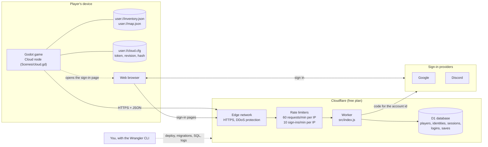
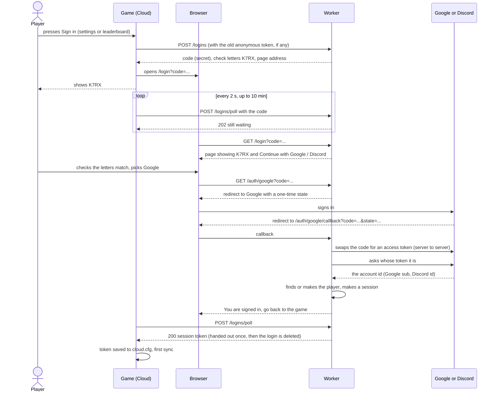
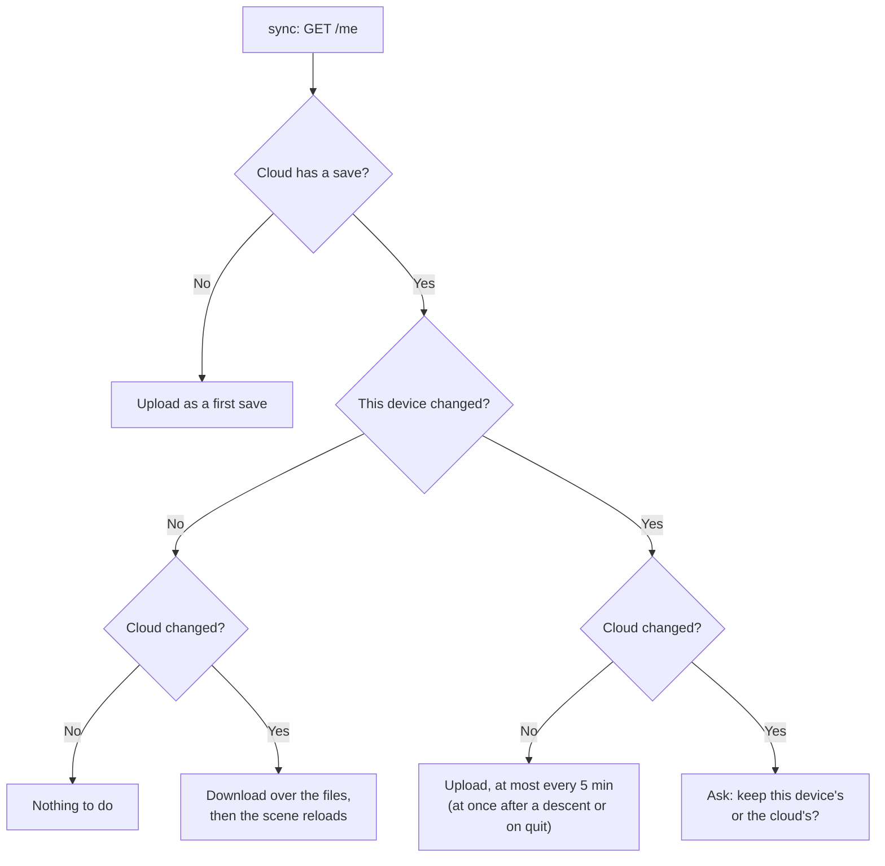
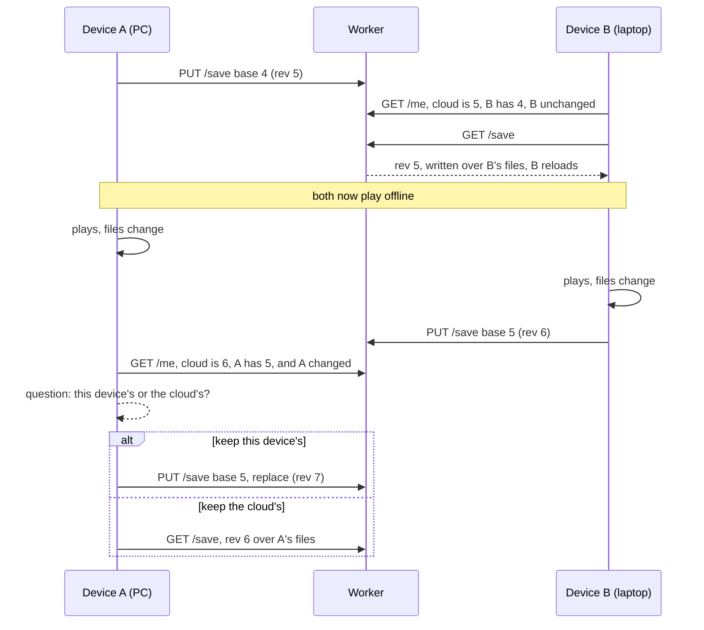
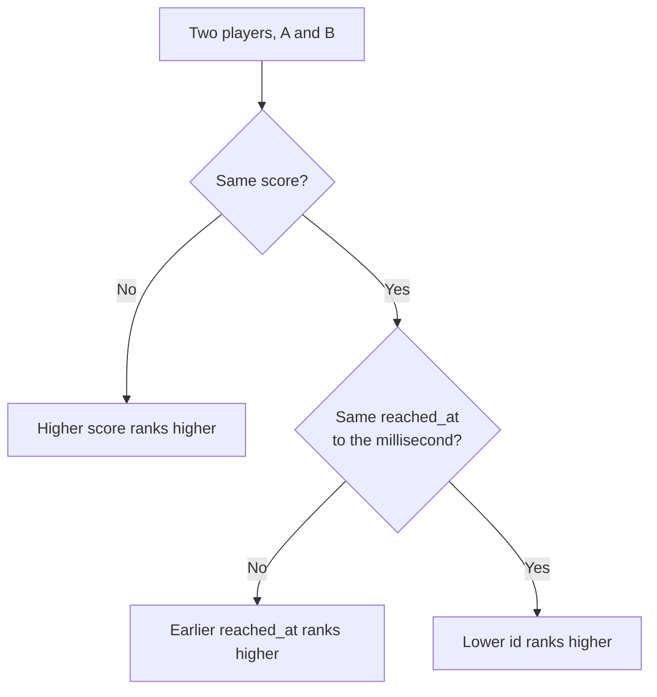
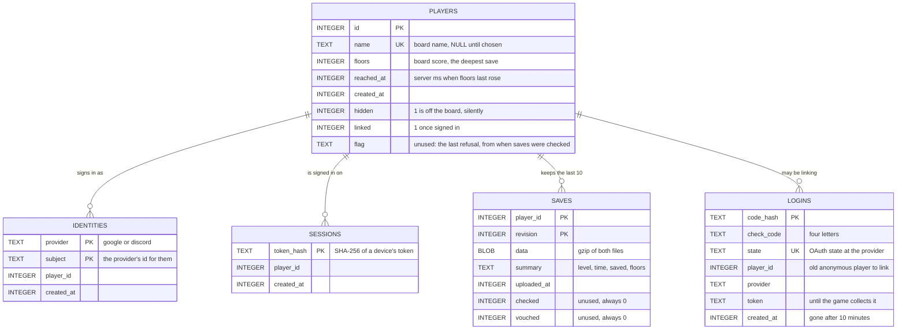
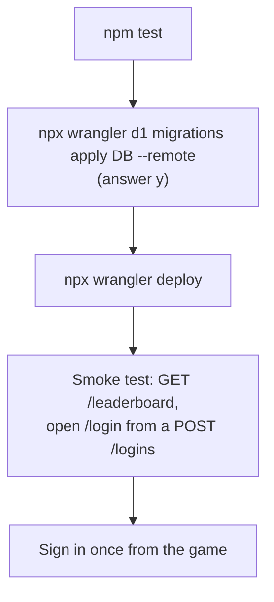

# Kobold Clicker's backend: accounts, cloud saves and the Gollux leaderboard

One **Cloudflare Worker** (a small JavaScript program run on Cloudflare's servers) and one
**Cloudflare D1** database (managed SQLite) give the game three things:

- **Signing in with Google or Discord.** It's optional; the game plays exactly the same without it.
- **Cloud saves.** Play on one computer and carry on on another. If two devices both played offline,
  the player is asked which save to keep. A save is taken at its word: the player is trusted not to cheat.
- **The Gollux leaderboard.** It shows each signed-in player's deepest descent as **`depth.floor`**
  (**3.14** is depth 3, 14 of its floors beaten): the deepest any of their saves reached. Of two
  equal scores, whoever reached it first stands higher.

At this game's scale it costs **$0 a month**, with no servers to patch. The Worker is one JavaScript
file, the database two migrations.

**Live:** `https://gollux-leaderboard.kobold-clicker.workers.dev`, on the Cloudflare account
*Dik.med.mur@gmail.com's Account*, workers.dev subdomain `kobold-clicker`. The Worker keeps the name
`gollux-leaderboard` it was first deployed under: shipped builds call that address forever
(`Cloud.URL`), so it is never renamed.

The diagrams are Mermaid. GitHub renders them as they are. In VS Code, install the *Markdown Preview
Mermaid Support* extension (`bierner.markdown-mermaid`) and open the preview (Ctrl+Shift+V).

---

## Contents

1. [How it fits together](#1-how-it-fits-together)
2. [Signing in](#2-signing-in)
3. [Cloud saves](#3-cloud-saves)
4. [Cheating](#4-cheating)
5. [The leaderboard](#5-the-leaderboard)
6. [The API](#6-the-api)
7. [The database](#7-the-database)
8. [The game's side](#8-the-games-side)
9. [Tools you need](#9-tools-you-need)
10. [Run it on your own machine](#10-run-it-on-your-own-machine)
11. [Set up the sign-in providers](#11-set-up-the-sign-in-providers)
12. [Deploy](#12-deploy)
13. [Running it: logs, cheaters, backups](#13-running-it-logs-cheaters-backups)
14. [What it costs](#14-what-it-costs)
15. [Security](#15-security)
16. [Customising it](#16-customising-it)
17. [Why this stack](#17-why-this-stack)
18. [Troubleshooting](#18-troubleshooting)
19. [Files](#19-files)

---

## 1. How it fits together



- **The game** keeps its save files as it always has. The `Cloud` node moves them to and from the
  server and keeps its own small file, `cloud.cfg`. It uses Godot's built-in `HTTPRequest`, with no
  plugin or SDK.
- **The browser** is where the player signs in, so the game never sees a password. The same flow works
  on Windows, Mac, Linux, Android, iOS and the web.
- **The Worker** is the only thing that touches the database.
- **Google and Discord** only tell the Worker a stable id for the account. The Worker never asks for
  an email, a name or a picture.

---

## 2. Signing in

It works like signing in to a TV app: the game shows a code, the browser does the signing in, and the
game waits until the server says it's done.



- **The check letters** stop a phishing trick. Someone could start a sign-in on their own game and
  send you the link: if you signed in there, *their* game would be signed in as you. The page shows
  four letters, and the player only continues if their own game shows the same ones. The page says so.
- **A login lasts 10 minutes.** Its session token is handed to the game once, then the row is deleted.
- **One account per provider identity.** Signing in with the same Google account on two devices is
  one player with two sessions (one per device). Google and Discord are separate accounts: there is
  no linking of the two.
- **The old anonymous leaderboard name** (from before accounts) goes to the device's first sign-in.
  Its old score starts again from zero, and the first upload sets it from the save.
- **Sign out** deletes this device's session only. **Delete cloud account** deletes the player, their
  identities, sessions and saves. Both keep the save files on the device.

---

## 3. Cloud saves

The save is the game's own two files, `inventory.json` and `map.json`: about 140 KB of JSON, about 20 KB
gzipped. The server keeps each player's **last 10 revisions**, and each upload says which revision it
grew from.

This device's side is kept in `cloud.cfg`:

- **`revision`**: the cloud revision this device's files grew from, or 0 for none.
- **`hash`**: the SHA-256 of the two files as they were at that revision.

So the game can tell whether **this device** changed (the files' hash differs from `hash`) and whether
**the cloud** changed (its newest revision differs from `revision`).



When it syncs:

| When | What |
|---|---|
| Start-up | Right after the scene is built. It judges "this device changed" by the files **as the scene found them**, before start-up wrote anything (`Cloud.launched`). Otherwise a start-up's own writes (the map, a camp's pay) would make every change of device a question. |
| Every 30 s while playing | Uploads when due (at most every `UPLOAD_EVERY`, 5 min). A download or a question waits until the game is **calm**: not in a fight, a camp, the black screen or another question. |
| After a descent | Uploads at once, so the board catches up. |
| Opening the leaderboard page | Uploads at once, then reads the board. |
| Closing the window | The scene closes (it banks the run and writes its saves), the upload goes with a 4 s timeout, then the game quits. On Android and iOS, when the app is paused. |

**A download** writes both files through `SafeFile` and tells the main scene, which reloads without
saving over them (`_on_cloud_replaced` sets `_resetting`).

**The question** shows both saves (level, time played, when saved, deepest descent) and nothing is
replaced until the player picks:

- *Keep the cloud's*: the cloud's save is downloaded.
- *Keep this device's*: it's uploaded with `replace`, in the cloud's place.



**Reset save** (settings) deletes the cloud's saves too, before the files, and the fresh game becomes
the cloud's first save. The question says so. A **transcension** is an ordinary save as far as the
cloud is concerned.

---

## 4. Cheating

**The server takes every save at its word** (since 2026-10-02): the player is trusted not to cheat. An
upload is turned away only when it isn't a save at all (400) or is far too big (413). The checks it once
made of a save against itself and against the one it grew from were removed: they turned down honest
saves.

What that leaves open: an edited save, its floors included, goes to the cloud and onto the board as it
is. The way to deal with a cheater is by hand: **take them off the board** (§13).

---

## 5. The leaderboard

A score is a number of dungeon floors, shown as depth and floor. 44 is 2 × 15 + 14, shown as **3.14**,
and killing depth 3's Gollux is 45, shown as **4.00**. `Cloud.score_text` formats it, with two digits
after the dot (`3.05`, never `3.5`).

**A player's score is the deepest any of their saves reached:** an upload's own `dungeon_floors`. It
only ever rises, so a restored backup or a reset never takes it down.

**Who is on it:** signed-in players with a board name and a score above 0, not `hidden`.

**Order:** score highest first, then `reached_at` earliest first, then `id`. `reached_at` is the
**server's** clock, and it moves only when the score rises, so the same score sent again changes
nothing.



---

## 6. The API

Every body is JSON, and every error is `{"error": "a sentence for the player"}`. The game shows that
sentence as it is. "Bearer" means `Authorization: Bearer <session token>`.

| Route | Auth | Body | Success | Errors |
|---|---|---|---|---|
| `POST /logins` | optional Bearer (an old anonymous token, to keep its name) | – | **201** `{code, check, url}` | 429 |
| `GET /login?code=` | – | – | the sign-in page (HTML) | 404 page: expired |
| `GET /auth/{google,discord}?code=` | – | – | 302 to the provider | 404 expired, 404 provider not set up |
| `GET /auth/{google,discord}/callback` | – | – | the "signed in" page | 400 cancelled, 404 expired, 502 provider failed |
| `POST /logins/poll` | – | `{code}` | **200** `{token, provider}` once; **202** `{pending}` | 404 expired or collected |
| `GET /me` | Bearer | – | `{name, floors, reached_at, rank, providers, save: {revision, uploaded_at, summary} or null}` | 401 |
| `PUT /me/name` | Bearer | `{name}` | the player's standing | 400 bad name, 409 taken |
| `DELETE /me` | Bearer | – | `{deleted}`: everything about the player gone | 401 |
| `DELETE /sessions/me` | Bearer | – | `{signed_out}`: this device's session gone | 401 |
| `GET /save` | Bearer | – | `{revision, uploaded_at, summary, inventory, map}` (the two files as text) | 401, 404 none |
| `PUT /save` | Bearer | `{base_revision, replace?, inventory, map}` | **200** `{revision, ...standing}` | 400 not a save, **409** `{revision, summary}` the cloud is newer, 413 |
| `DELETE /save` | Bearer | – | `{deleted}`: the cloud's saves gone, the board untouched | 401 |
| `GET /leaderboard?limit=50` | optional Bearer | – | `{top: [{rank, name, floors, reached_at}], me}` | 401 if a token is sent and unknown |
| `GET /privacy` | – | – | the privacy page (HTML) | – |

Rules:

- **Every route:** 60 requests a minute per IP address.
- **`POST /logins`:** 10 a minute per IP address.
- A sign-in polls 30 times a minute.
- A playing game makes about 2 requests a minute: the 30 s sync reads `/me`.

---

## 7. The database



- **`migrations/0001_players.sql`**: the anonymous leaderboard it started as.
- **`migrations/0002_accounts.sql`**: accounts and saves. It rebuilds `players` (a name may be NULL,
  the token moved to `sessions`) and keeps every old row.

**Schema changes are migrations.** Add `migrations/0003_<what>.sql`, and never edit one that has been
applied to the live database (`npx wrangler d1 migrations list DB --remote` shows which have been).

---

## 8. The game's side

| Piece | What it does |
|---|---|
| `Scenes/cloud.gd` (`Cloud`) | Everything above, from the game's side. Signing in, out and deleting (`sign_in`, `cancel_sign_in`, `sign_out`, `delete_account`), the board name (`choose_name`), the board (`refresh`), syncing (`sync`, `push`, `leave`, `keep_cloud`, `keep_device`, `forget_save`), and `decide`, `summary_of`, `hash_of`, `score_text`. One lives under the root (`NODE`), so it outlives the scene's reloads. Off (`path` empty) anywhere but the player's own save. |
| `Scenes/UI/cloud_question.gd` (`CloudQuestion`) | The question over the whole window: two saves side by side, and two answers. |
| `Scenes/UI/settings_page.gd` | **Cloud save** section: Sign in, the four letters and Cancel while signing in, then "Signed in with Google", when it last saved, Sign out, and Delete cloud account (asked in place). Reset's question says "here and in the cloud" while signed in. |
| `Scenes/UI/leaderboard_page.gd` | Sign in, a name to choose, or the player's row, over the board anyone may read. No explanatory sentences on the game's pages: what a button does is in its tooltip. |
| `Scenes/main_scene.gd` | `_find_cloud` (made or found again, `launched`, `calm`, the signals), a sync at the end of start-up and after a descent, `_on_cloud_replaced` (reload), `_on_cloud_asked` (the question), quitting through `Cloud.leave`, and Reset through `forget_save`. |

**Pointing the game at a server:** `Cloud.URL` is the live Worker. The environment variable
`LEADERBOARD_URL` overrides it, and the account then goes in `user://cloud_dev.cfg`, so testing never
touches the real one:

```powershell
$env:LEADERBOARD_URL = "http://127.0.0.1:8787"
& "C:\Users\Dik\Godot_v4.7.2-stable_win64.exe\Godot_v4.7.2-stable_win64_console.exe" --path .
```

---

## 9. Tools you need

| Tool | Why | Get it |
|---|---|---|
| **Cloudflare account** (free) | hosts the Worker and D1 | have it: *Dik.med.mur@gmail.com's Account* |
| **Node.js 20+** (you have 24) | runs Wrangler and the tests | <https://nodejs.org> |
| **Wrangler 4** | Cloudflare's CLI: dev server, deploy, D1, secrets, logs | `npm install` in this folder |
| **A Google Cloud project** (free) | Sign in with Google | §11 |
| **A Discord application** (free) | Sign in with Discord | §11 |
| Godot 4.7 | the game | set up already (root `CLAUDE.md`) |

Run every command below **from `backend/leaderboard/`**. `backend/.gdignore` keeps Godot out of
`node_modules`.

---

## 10. Run it on your own machine

No Cloudflare account and no provider is needed for any of this.

```sh
npm install                  # once
npm test                     # ~15 s
```

**`npm test`** starts the Worker on a fresh local database with a **stand-in for Google's and Discord's
servers**, so the real sign-in code runs end to end. It covers:

- sign-in, and one player across devices;
- the old name kept on the first sign-in;
- expired codes refused;
- names;
- a save round-tripping byte for byte;
- the board taking a save's floors, and never going down;
- conflicts, and replace;
- a save taken at its word, and only a non-save turned away;
- the board's order;
- signing out and deleting;
- the sign-in rate limit.

The stand-in is switched on only by `PROVIDER_ORIGIN`, which only the tests set.

**A local server** for the game to talk to:

```sh
npx wrangler d1 migrations apply DB --local
npx wrangler dev --var GOOGLE_CLIENT_ID:<id> --var GOOGLE_CLIENT_SECRET:<secret>
```

Real sign-in on a local server also needs `http://127.0.0.1:8787/auth/google/callback` added to the
Google client's redirect URIs.

The game's side is covered by `python tests/run_all.py cloud`: decide, the summary, the account file,
the question, and the mirrored numbers. `combat` and `inventory` cover the floors a descent banks.

---

## 11. Set up the sign-in providers

Both are free, and both only ever tell the Worker an id. Replace `<worker>` with
`https://gollux-leaderboard.kobold-clicker.workers.dev`.

### Google

1. Go to <https://console.cloud.google.com> and create a project, **Kobold Clicker**.
2. Open **Google Auth Platform** → **Get started**. App name **Kobold Clicker**, your support email,
   Audience **External**, your contact email.
3. Go to **Clients → Create client**, type **Web application**. Under *Authorized redirect URIs*, add
   `<worker>/auth/google/callback`, then create it. Keep the **Client ID** and **Client secret**.
4. Go to **Audience → Publish app**. Until then, only listed test users can sign in. The only scope
   asked for is `openid`, which needs no review.
5. *Optional:* under **Branding**, set the privacy policy link to `<worker>/privacy`.

### Discord

1. Go to <https://discord.com/developers/applications> → **New Application**, **Kobold Clicker**.
2. Open **OAuth2** → *Redirects* → add `<worker>/auth/discord/callback` → **Save Changes**.
3. Keep the **Client ID**. Click **Reset Secret** and keep the **Client Secret**. The only scope asked
   for is `identify`.

### Give them to the Worker

- **The client ids** aren't secret. They go in `wrangler.toml` under `[vars]`
  (`GOOGLE_CLIENT_ID`, `DISCORD_CLIENT_ID`) and are committed. An empty one hides that provider's button.
- **The secrets** never go in a file:

```sh
npx wrangler secret put GOOGLE_CLIENT_SECRET
npx wrangler secret put DISCORD_CLIENT_SECRET
npx wrangler secret list        # shows their names, never their values
```

---

## 12. Deploy



```sh
npm test
npm run deploy      # = migrations to the live database, then the Worker
```

- **A deploy switches over in seconds.** `npx wrangler rollback` puts the previous version back.
- **A migration can't be rolled back that way.** Restore the database with Time Travel (§13) if one goes
  wrong.
- **Never rename the Worker or drop a route a shipped build calls.** Add routes; don't change what old
  ones mean.

---

## 13. Running it: logs, cheaters, backups

**Live logs** (every request and every `console.error`, including a failed token exchange with a
provider):

```sh
npx wrangler tail
```

**Look at the data:**

```sh
npx wrangler d1 execute DB --remote --command "SELECT id, name, floors, linked, hidden FROM players ORDER BY floors DESC LIMIT 20"
npx wrangler d1 execute DB --remote --command "SELECT COUNT(*) AS players, SUM(linked) AS signed_in, SUM(floors > 0 AND name IS NOT NULL AND linked = 1) AS on_board FROM players"
```

**Take a player off the board** (a cheater, a rude name), silently:

```sh
npx wrangler d1 execute DB --remote --command "UPDATE players SET hidden = 1 WHERE name = 'xX_Cheater_Xx'"
```

**Give a name back:**

```sh
npx wrangler d1 execute DB --remote --command "UPDATE players SET name = NULL WHERE name = '...'"
```

The player then chooses another from the leaderboard page.

**A player's save history:**

```sh
npx wrangler d1 execute DB --remote --command "SELECT revision, summary, datetime(uploaded_at/1000,'unixepoch') FROM saves WHERE player_id = 12 ORDER BY revision"
```

**Backups:**

- **Time Travel:** restore the whole database to any minute of the last 7 days (free) or 30 days (paid).

  ```sh
  npx wrangler d1 time-travel info DB
  npx wrangler d1 time-travel restore DB --timestamp=2026-09-30T12:00:00Z
  ```

- **An export you keep:** `npx wrangler d1 export DB --remote --output=backup.sql`

---

## 14. What it costs

This is Cloudflare's free plan as published at the time of writing. Check
<https://developers.cloudflare.com/workers/platform/pricing/> and
<https://developers.cloudflare.com/d1/platform/pricing/>.

| Resource | Free plan | A player uses, per hour played |
|---|---|---|
| Worker requests | 100,000 / day | ~130: a `/me` every 30 s, and 12 uploads |
| D1 rows written | 100,000 / day | ~40: an upload writes its row, prunes the 11th, may move the board |
| D1 rows read | 5 million / day | a few hundred |
| D1 storage | 5 GB | 10 revisions × ~20 KB = ~200 KB a player, so ~25,000 players |

That's about **750 player-hours a day** free. The limit that bites first is requests, from the 30 s
tick. Past that, **Workers Paid is $5/month** for 10 million requests.

Two dials trade freshness for cost: `Cloud.TICK` (30 s) and `Cloud.UPLOAD_EVERY` (5 min). A tick of 120 s
quarters the requests; a device then notices another's save within 2 minutes instead of 30 seconds.

When a free limit is hit, calls fail until midnight UTC. The game says "The cloud cannot be reached",
plays on, and syncs later. Nothing is lost, because the files on the device are the save.

---

## 15. Security

| Threat | Defence |
|---|---|
| Stealing a session | Tokens are 256 random bits, sent only over HTTPS, and stored only as SHA-256. A leaked database holds no token. |
| A sign-in link sent by someone else | The four check letters on both screens; the page says to close it if they differ. |
| Forged OAuth callbacks | The one-time `state`, bound to one login and gone once used. The code is swapped server to server with the client secret, which never leaves Cloudflare. |
| Replaying a login code | A login gives out its token once and is deleted. Codes expire after 10 minutes. |
| The code leaking to the provider | Every page is sent with `Referrer-Policy: no-referrer`, a CSP of `default-src 'none'`, and `X-Frame-Options: DENY`. |
| Spam | Per-IP rate limits and Cloudflare's DDoS protection. The body limit is 4 MB. |
| Junk data | Names are whitelisted; saves are parsed; all SQL is parameterised. |
| Personal data | Only a provider's id, the chosen name, the save and its times are kept. `/privacy` says so, and **Delete cloud account** removes all of it (GDPR's right to erasure). |

Cheating is §4.

---

## 16. Customising it

| You want | Change |
|---|---|
| Apple sign-in (for iOS) | Needs the Apple Developer Program ($99/yr). Add an `apple` entry to `PROVIDERS` in `src/index.js`. Apple's client secret is a signed JWT (ES256, made from its key) rather than a string, and it answers with `id_token` instead of a user endpoint. Add the route to the regex, a button appears |
| Link Google and Discord into one account | A signed-in `POST /logins` that attaches the new identity to the caller's player instead of finding or making one |
| Rename from the game | `PUT /me/name` already renames. The leaderboard page only asks while there is no name |
| Replay descents on a server | Headless Godot in a container (level 3). Out of reach of Workers |
| A web build | Add CORS headers (`Access-Control-Allow-Origin`, and an `OPTIONS` answer for `Authorization`) to `json()`. Sign-in already works in a browser tab |
| Keep more revisions | `KEEP_REVISIONS` |
| Seasons | A `season` on `saves` or a `scores` table, and `?season=` on `/leaderboard` |

---

## 17. Why this stack

The brief was cloud-hosted, as simple as possible, cheap, and customisable.

| Option | Why not (or why) |
|---|---|
| **Cloudflare Workers + D1** ✅ | Real code and real SQL you own; no server; no cold starts; never pauses; local dev and tests run on the same runtime. |
| Supabase (Postgres + Auth) | Its free projects pause after a week idle. The rules would be SQL functions and row-level security instead of plain code. |
| Firebase (Auth + Firestore) | Billed per document read. Community-made Godot SDKs. The rules become a second language. |
| A rented server | ~$5/mo from day one, and you patch the OS, renew TLS and keep it running. It's needed only for level 3 (running the game). |
| Steam Cloud and leaderboards | Free and the right answer *if* the game ships on Steam, for Steam players only. |
| PlayFab, Nakama, SilentWolf | Faster to start, but the ranking and pricing are theirs. |

A hosted sign-in service (Auth0, Clerk, Firebase Auth) wasn't worth it for two providers asking only
for an id: the OAuth code is about 80 lines in `src/index.js`.

---

## 18. Troubleshooting

| Symptom | Cause / fix |
|---|---|
| The sign-in page has no buttons | `GOOGLE_CLIENT_ID` / `DISCORD_CLIENT_ID` empty in `wrangler.toml`; deploy after setting them. |
| Google says `redirect_uri_mismatch` | The client's redirect URI must be exactly `<worker>/auth/google/callback`: https, no trailing slash. |
| Google says access blocked, app not verified | The app isn't published (§11 Google, step 4), or it asks for more than `openid`. |
| "The sign-in did not go through" | The token exchange failed: a wrong or missing secret. `npx wrangler tail` shows the provider's answer. |
| "Signing in ran out of time" | The browser step took over 10 minutes, or the page was closed. Start again. |
| The same question every start-up | Something writes the save before `_find_cloud` runs `launched()`. Keep `launched()` ahead of every write in `_ready`. |
| "The cloud cannot be reached" | Offline, or the free limit is used up for today. It syncs on its own later. |
| `no such table` | `npx wrangler d1 migrations apply DB --remote`. |
| `npm test` hangs on Windows | An old `wrangler dev` holds the port or `.wrangler`. Stop it and delete `.wrangler/test`. |

---

## 19. Files

```
backend/
├── .gdignore                  keeps Godot out of this folder
└── leaderboard/
    ├── README.md              this file
    ├── wrangler.toml          the Worker, the D1 binding, rate limits, client ids, logs
    ├── package.json           wrangler + the test / deploy scripts
    ├── migrations/
    │   ├── 0001_players.sql   the anonymous leaderboard
    │   └── 0002_accounts.sql  accounts, sessions, sign-ins in progress, saves
    ├── src/
    │   └── index.js           the routes: sign-in, account, saves, board, pages
    └── test.mjs               end to end on a local D1 with stand-in providers (npm test)

Scenes/cloud.gd                  the game's client
Scenes/UI/cloud_question.gd      the question between two saves
Scenes/UI/leaderboard_page.gd    the board page
tests/test_cloud.gd              the game's side, and the mirrored numbers
```
