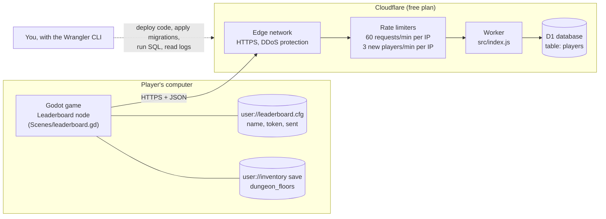
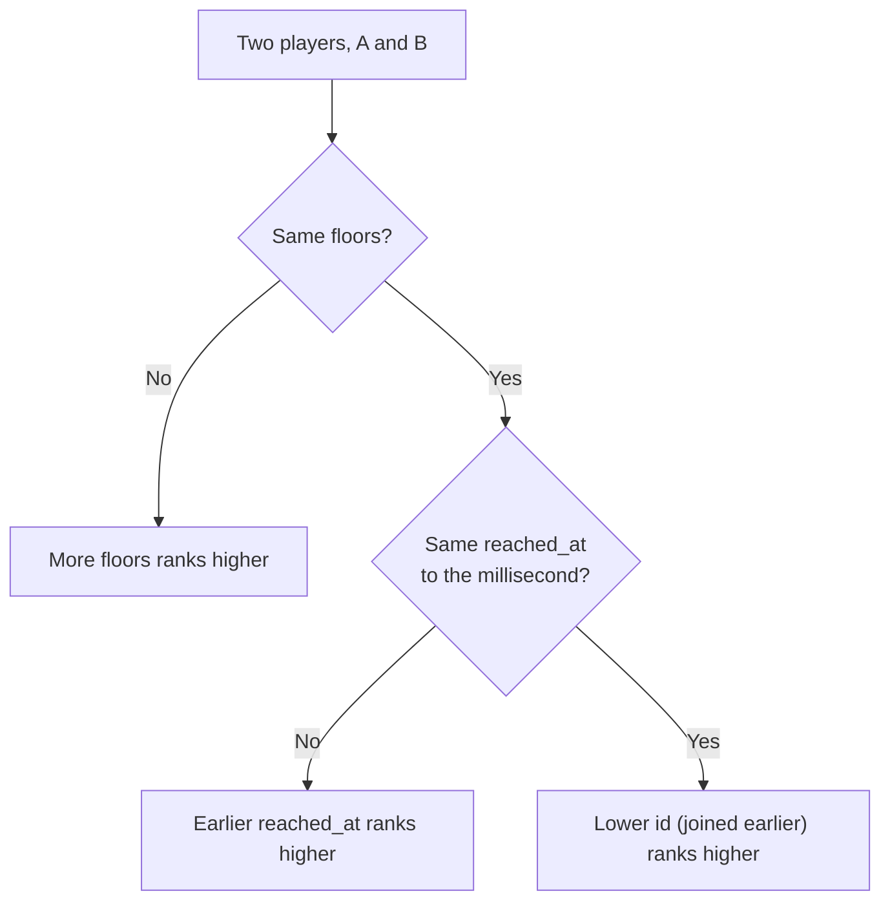
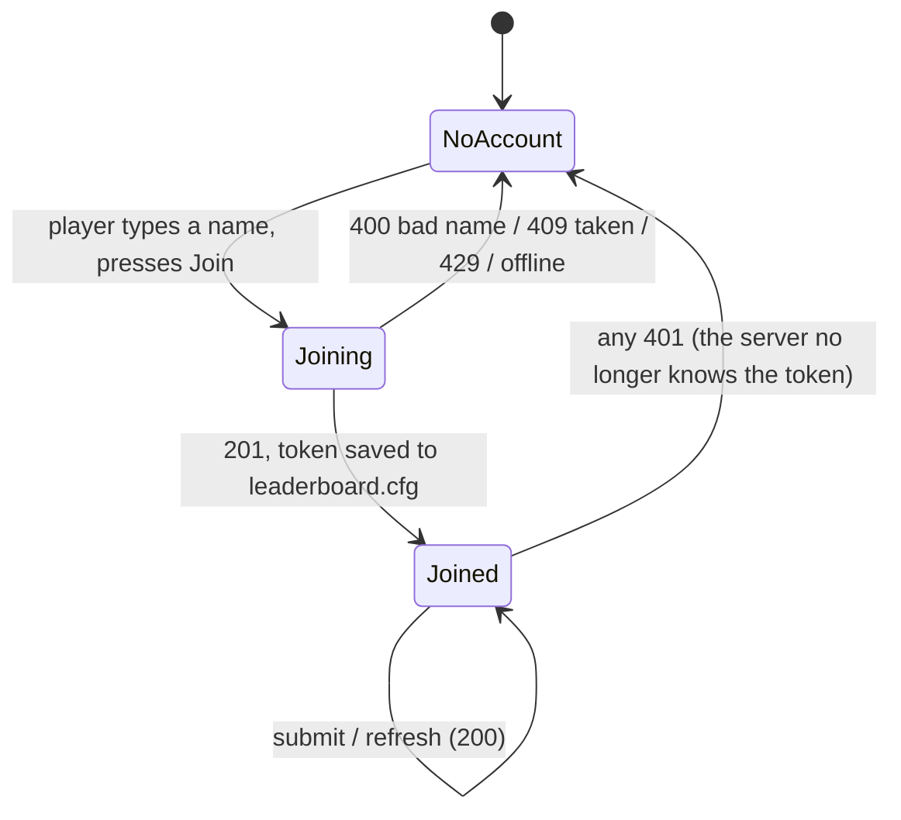
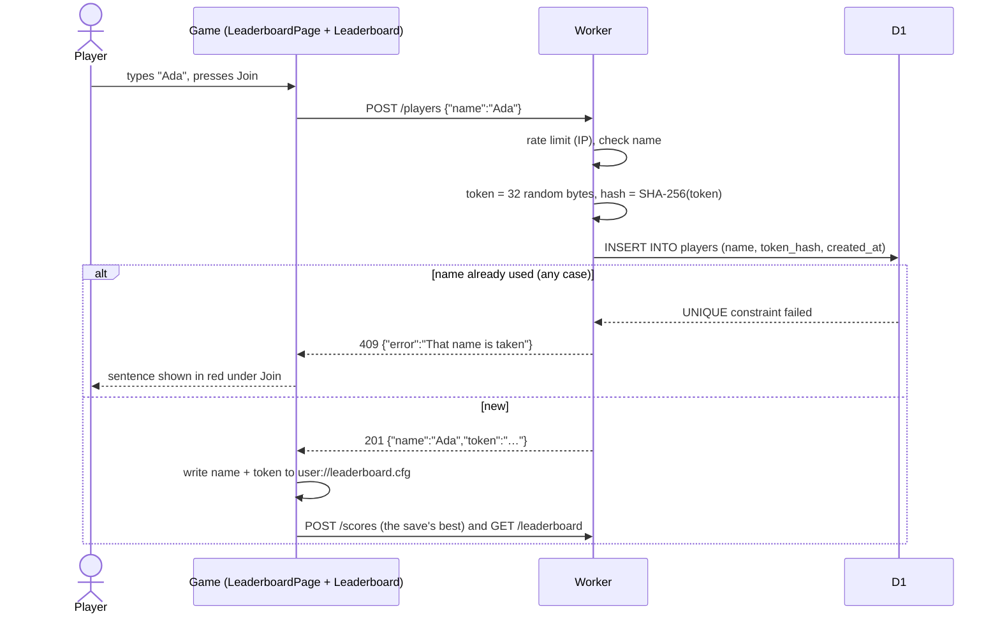
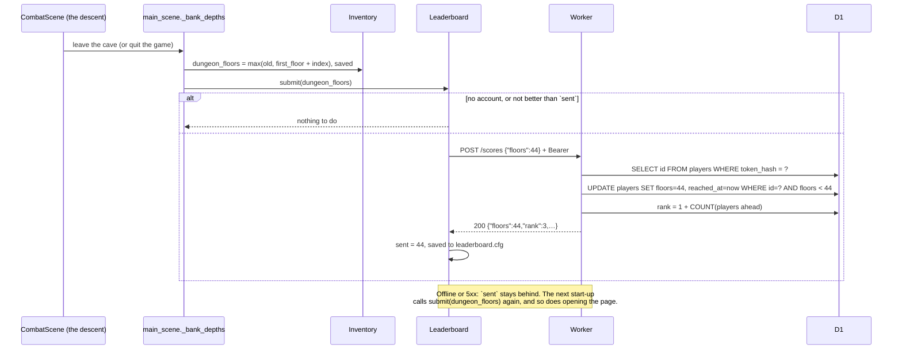
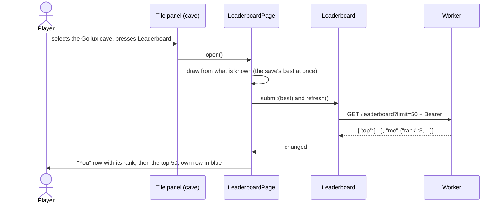
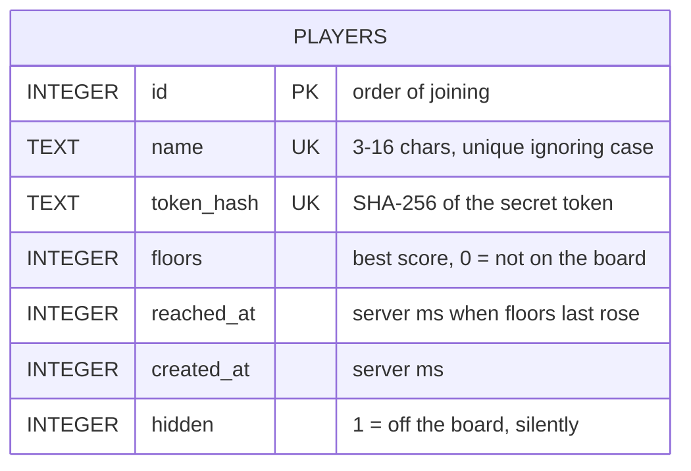
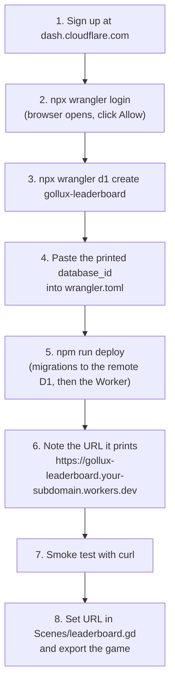

# The Gollux leaderboard

A global leaderboard for the dungeon (The Descent). Every player's best descent is shown as
**`depth.floor`**, for example **3.14**: depth 3, fourteen of its floors beaten. Players are ranked by
score, and **of two equal scores, whoever reached it first stands higher**.

The backend is one **Cloudflare Worker** (a small JavaScript program run on Cloudflare's servers) and
one **Cloudflare D1** database (managed SQLite). At this game's scale it costs **$0 a month**. There
are no servers to patch, and all of it is ~150 lines of JavaScript and SQL in this folder.

The diagrams are Mermaid. GitHub renders them as they are. In VS Code, install the *Markdown Preview
Mermaid Support* extension (`bierner.markdown-mermaid`) and open the preview (Ctrl+Shift+V).

---

## Contents

1. [How it fits together](#1-how-it-fits-together)
2. [The score and the ranking](#2-the-score-and-the-ranking)
3. [Accounts](#3-accounts)
4. [The API](#4-the-api)
5. [The database](#5-the-database)
6. [The game's side](#6-the-games-side)
7. [Tools you need](#7-tools-you-need)
8. [Run it on your own machine](#8-run-it-on-your-own-machine)
9. [Deploy it (first time)](#9-deploy-it-first-time)
10. [Deploy a change](#10-deploy-a-change)
11. [Running it: logs, cheaters, backups](#11-running-it-logs-cheaters-backups)
12. [What it costs](#12-what-it-costs)
13. [Security and cheating, honestly](#13-security-and-cheating-honestly)
14. [Customising it](#14-customising-it)
15. [Why this stack](#15-why-this-stack)
16. [Troubleshooting](#16-troubleshooting)
17. [Files](#17-files)

---

## 1. How it fits together



- **The game** keeps its own best score (`Inventory.dungeon_floors`) and an account file. It talks
  to the Worker over HTTPS with Godot's built-in `HTTPRequest`. No plugin or SDK is needed.
- **The Worker** is `src/index.js`. It has three routes, checks everything it is sent, and is the
  only thing that touches the database.
- **D1** holds one table, `players`: one row a player, with their best score and when they reached
  it.
- **You** manage all of it from the terminal with **Wrangler**, Cloudflare's CLI. It is installed in
  this folder by `npm install`.

---

## 2. The score and the ranking

The dungeon is endless and made of **depths**. Each depth is **15 floors**, and floor 15 is Gollux
(`Encounter.DUNGEON.enemies`). The game stores one number, **`floors`**: every floor ever beaten in
one go, counted from the top.

| What happened | `floors` | Shown as |
|---|---|---|
| Beat 5 floors of depth 1 | 5 | **1.05** |
| Killed depth 2's Gollux, then beat 14 floors of depth 3 | 2 × 15 + 14 = 44 | **3.14** |
| Killed depth 3's Gollux (floor 45) | 45 | **4.00** |

`score_text(floors)` = `"%d.%02d" % [floors / 15 + 1, floors % 15]`

- **Ranked as one integer, displayed as two.** Sorting "3.14" as a decimal would put 3.5 above 3.14.
  One whole number sorts correctly, and the dot is only for display.
- **Two digits after the dot** (`3.05`, never `3.5`), so a score never reads as a fraction.
- **Killing Gollux reads as the next depth's `.00`**, which is what `Encounter.depth()` already says:
  depth moves as Gollux falls. The alternative, `3.15`, would be the same number shown differently.
  Change it in `Leaderboard.score_text` if you prefer that; the server never formats scores.

**Order:** `floors` highest first, then **`reached_at`** earliest first, then `id` (the order of
joining, only to break a same-millisecond tie).



`reached_at` is **the server's clock** at the moment a *higher* score arrived. The game's clock is
never used: a player could set it back. Sending the same score again, or a lower one, changes nothing,
so the game can retry freely without losing anyone's place in a tie.

One side effect: a descent made offline counts from when the game was next online and sent it (at
the next start-up, see [§6](#6-the-games-side)).

---

## 3. Accounts

Accounts are **anonymous**: no e-mail, no password, no third-party login.

1. The player types a name (3–16 letters, digits, spaces, `_` or `-`, unique ignoring case).
2. The server makes a random 256-bit **token**, stores only its **SHA-256 hash**, and returns the
   token **once**.
3. The game keeps the name and token in `user://leaderboard.cfg`. On Windows that is
   `%APPDATA%\Godot\app_userdata\Incremendal Side Scroller\leaderboard.cfg`. Every later call sends
   `Authorization: Bearer <token>`.



What that means:

- **The file is the account.** A player who copies `leaderboard.cfg` to a new computer keeps their
  name. One who loses it joins again under a new name, and their old row stays on the board.
- **A leaked database leaks no tokens**, only their hashes.
- **Renaming** is not built. It is one more route (`PATCH /players/me`) and a text field on the page.
- **Steam** would be the upgrade if the game ships there: send a Steam auth ticket instead of a name,
  verify it in the Worker with Steam's Web API, and store the SteamID beside the row.

---

## 4. The API

The base URL is `https://gollux-leaderboard.<your-subdomain>.workers.dev`. Every body is JSON, and
every error is `{"error": "a sentence for the player"}`. The game shows that sentence as it is.

| Route | Auth | Body | Success | Errors |
|---|---|---|---|---|
| `POST /players` | – | `{"name": "Ada"}` | **201** `{"name", "token"}` | 400 bad name · 409 name taken · 429 |
| `POST /scores` | Bearer | `{"floors": 44}` | **200** `{"name", "floors", "reached_at", "rank"}` | 400 not a whole number in 0..1,000,000 · 401 |
| `GET /leaderboard?limit=50` | optional Bearer | – | **200** `{"top": [{"rank", "name", "floors", "reached_at"}], "me": {…} or null}` | 401 if a token is sent and unknown |

Rules the Worker applies:

- **Every route:** 60 requests a minute per IP address, then 429.
- **`POST /players`:** 3 new players a minute per IP address, then 429.
- `limit` is 1–100 and defaults to 100.
- `rank` is `null` for a player who has not beaten a floor yet. They are not on the board.
- `reached_at` is milliseconds since 1970 (UTC).

Try it by hand while `npm run dev` is running:

```sh
curl -X POST localhost:8787/players -H "Content-Type: application/json" -d '{"name":"Ada"}'
# {"name":"Ada","token":"3f9c...e1"}
curl -X POST localhost:8787/scores -H "Authorization: Bearer 3f9c...e1" -d '{"floors":44}'
# {"name":"Ada","floors":44,"reached_at":1790421405189,"rank":1}
curl localhost:8787/leaderboard
```

### Joining



### After a descent



### Opening the board



---

## 5. The database



The schema is in `migrations/0001_players.sql`. One **partial index**,
`players_board (floors DESC, reached_at, id) WHERE hidden = 0 AND floors > 0`, holds exactly the rows
on the board in board order, so reading the top 50 reads 50 index entries.

The board is one query:

```sql
SELECT name, floors, reached_at FROM players
WHERE hidden = 0 AND floors > 0
ORDER BY floors DESC, reached_at, id LIMIT ?;
```

A player's rank is one plus the number of rows ahead of them in that order (`standing` in
`src/index.js`).

**Schema changes are migrations:** add `migrations/0002_<what>.sql` and never edit a migration that
has already been applied to the live database. See [§14](#14-customising-it).

---

## 6. The game's side

| Piece | What it does |
|---|---|
| `Scenes/leaderboard.gd` (`Leaderboard`, a `Node`) | The account file, and the three calls (`join`, `submit`, `refresh`). Each call is its own `HTTPRequest` with a 10 s timeout. It never blocks and never retries in a loop. `score_text(floors)` formats a score. `URL` is the one line to set after deploying. |
| `Scenes/UI/leaderboard_page.gd` (`LeaderboardPage`) | A left-hand page. Before joining it shows a name field and **Join**. After joining it shows the player's row with rank, the top 50 (their own row in blue, the date reached in each row's tooltip) and **Refresh**. |
| `Scenes/Items/inventory.gd` | `dungeon_floors`, the best floors ever beaten. Saved (save version 26), carried through every transcension like `dungeon_depth`. A version-25 save starts at `dungeon_depth * 15`. |
| `Scenes/main_scene.gd` | Makes the `Leaderboard` **only on the player's real save** (tests and screenshots get one that is off). Sends the best at start-up, sends it again in `_bank_depths` whenever a descent ends, and puts a **Leaderboard** button under "Depth n won" on the cave's tile panel. |

`sent` in the account file is the best the server has acknowledged. `submit` does nothing unless
the save's best is higher. That is the whole retry mechanism: any send that failed is sent again the
next time the game starts or the page opens.

**Pointing the game at a server:**

- **Release:** set `const URL := "https://gollux-leaderboard.<you>.workers.dev"` in
  `Scenes/leaderboard.gd`. While it is `""` the page says the leaderboard is not set up, and nothing
  calls out.
- **Development:** set the environment variable `LEADERBOARD_URL`, which overrides `URL`. The account
  then goes in `user://leaderboard_dev.cfg`, so testing never touches your real account.

  ```powershell
  $env:LEADERBOARD_URL = "http://127.0.0.1:8787"
  & "C:\Users\Dik\Godot_v4.7.2-stable_win64.exe\Godot_v4.7.2-stable_win64_console.exe" --path .
  ```

---

## 7. Tools you need

| Tool | Why | Get it |
|---|---|---|
| **Cloudflare account** (free) | hosts the Worker and D1 | <https://dash.cloudflare.com/sign-up>. No card needed on the free plan. |
| **Node.js 20+** (you have 24) | runs Wrangler and the tests | <https://nodejs.org> |
| **Wrangler 4** | Cloudflare's CLI: dev server, deploy, D1, logs | installed into this folder by `npm install` (`devDependencies`) |
| Godot 4.7 | the game | already set up (see the root `CLAUDE.md`) |
| *optional* a domain on Cloudflare | a URL like `leaderboard.yourgame.com` instead of `workers.dev` | Cloudflare Registrar or any registrar |

Run all commands below **from `backend/leaderboard/`**. `backend/.gdignore` keeps Godot from importing
`node_modules`.

---

## 8. Run it on your own machine

No Cloudflare account is needed for any of this. Wrangler runs the same runtime locally (`workerd`),
with a local SQLite file standing in for D1.

```sh
cd backend/leaderboard
npm install                                              # once
npx wrangler d1 migrations apply DB --local              # once, and after each new migration
npm run dev                                              # http://127.0.0.1:8787, reloads on save
```

**Tests:** `npm test` starts the Worker on a fresh local database (`.wrangler/test`) and checks the
ranking and tie order, retries, validation, auth and the rate limit. They take about 7 seconds.

```sh
npm test
# ✔ ranks by floors, then by who reached them first
# ✔ a repeated or lower score keeps its place
# ✔ a player with no floor is not on the board
# ✔ names are unique whatever their case, and checked
# ✔ a bad token or score is refused
# ✔ one address may make three players a minute
```

The game's own side is covered by `python tests/run_all.py combat inventory`: the score a descent
banks, the save round-trip, and that a test never calls the leaderboard.

---

## 9. Deploy it (first time)



**1. Create the account** at <https://dash.cloudflare.com/sign-up>. The first time you open
*Workers & Pages* it asks you to choose a `workers.dev` subdomain (for example `dik`). That name is
part of the URL.

**2. Log Wrangler in:**

```sh
npx wrangler login
npx wrangler whoami        # shows the account it will deploy to
```

**3. Create the database:**

```sh
npx wrangler d1 create gollux-leaderboard
```

It prints a block ending in `database_id = "xxxxxxxx-xxxx-…"`.

**4. Paste that id** into `wrangler.toml` in place of `00000000-0000-0000-0000-000000000000`, and commit
it. The id is not a secret: nothing can reach the database without your Cloudflare login.

**5. Deploy:**

```sh
npm run deploy
```

This runs `wrangler d1 migrations apply DB --remote` (answer `y` when it lists the migration) and
then `wrangler deploy`, which uploads `src/index.js` and prints the URL.

**6.–7. Smoke test** against the real URL:

```sh
curl https://gollux-leaderboard.<you>.workers.dev/leaderboard
# {"top":[],"me":null}
```

**8. Point the game at it:** set `URL` in `Scenes/leaderboard.gd` to that address (no trailing slash),
commit, and export. Players' games create accounts the first time they press **Join**.

**Optional: your own domain.** In the dashboard go to *Workers & Pages → gollux-leaderboard → Settings
→ Domains & Routes → Add → Custom domain*, enter `leaderboard.yourgame.com`, and then change `URL`.
Cloudflare makes the certificate itself.

---

## 10. Deploy a change

```sh
npm test            # locally first
npm run deploy      # applies any new migration, then uploads the Worker
```

- A deploy switches over in seconds with no downtime. Every deploy is kept as a version, and
  `npx wrangler rollback` puts the previous one back.
- **The game keeps talking to old builds' URLs forever.** A released game never updates its `URL`, so
  never rename the Worker or drop a route that a shipped build uses. Add routes; do not change the
  meaning of old ones.

---

## 11. Running it: logs, cheaters, backups

**Live logs** (every request and every `console.error`):

```sh
npx wrangler tail
```

Logs are also kept in the dashboard (*Workers & Pages → gollux-leaderboard → Observability*), because
`wrangler.toml` turns `observability` on.

**Look at the data:**

```sh
npx wrangler d1 execute DB --remote --command "SELECT id, name, floors, datetime(reached_at/1000,'unixepoch') AS reached, hidden FROM players ORDER BY floors DESC LIMIT 20"
npx wrangler d1 execute DB --remote --command "SELECT COUNT(*) AS players, SUM(floors > 0) AS on_board FROM players"
```

**Take a player off the board** (a cheater or a rude name). They are not told, and they still see
their own row:

```sh
npx wrangler d1 execute DB --remote --command "UPDATE players SET hidden = 1 WHERE name = 'xX_Cheater_Xx'"
```

Set it back to `0` to restore them. To **free a name** so someone else can use it, delete the row
(`DELETE FROM players WHERE name = '…'`). That player's game gets a 401 and offers Join again.

**Undo a mistake / backups:**

- **Time Travel:** D1 can restore the database to any minute in the last 7 days (free plan) or 30
  days (paid).

  ```sh
  npx wrangler d1 time-travel info DB                      # current bookmark
  npx wrangler d1 time-travel restore DB --timestamp=2026-09-26T12:00:00Z
  ```

- **A file you keep:**

  ```sh
  npx wrangler d1 export DB --remote --output=backup.sql
  ```

---

## 12. What it costs

Cloudflare's free plan, as published at the time of writing. Check
<https://developers.cloudflare.com/workers/platform/pricing/> and
<https://developers.cloudflare.com/d1/platform/pricing/> before relying on these numbers.

| Resource | Free plan | This leaderboard uses |
|---|---|---|
| Worker requests | 100,000 / day | ~1 per descent + 2 per page open + 1 per start-up |
| Worker CPU | 10 ms / request | ~1 ms (one or two small queries) |
| D1 rows read | 5 million / day | ~50 per board read, plus the rank count (the rows ahead of the player) |
| D1 rows written | 100,000 / day | 1 per join, 1 per *improved* score |
| D1 storage | 5 GB | ~200 bytes a player (25 million players) |

A player who plays daily makes perhaps 15–20 requests a day, so the free plan carries several thousand
**daily** players. Past that, **Workers Paid is $5/month** and covers 10 million requests and 25
billion D1 row reads a month.

When a free limit is hit, requests fail for the rest of the UTC day. The game only shows "The
leaderboard cannot be reached" and resends later. Nothing is lost, because the score lives in the save.

**The one query that grows** is the rank count: it reads every row ahead of the player. At tens of
thousands of players, cache the board (see the `ponytail:` note in `standing`, and [§14](#14-customising-it)).

---

## 13. Security and cheating, honestly

**What is protected:**

| Threat | Defence |
|---|---|
| Someone posts scores as another player | Every write needs that player's token. Only its SHA-256 is stored. |
| Scripted account or request spam | Per-IP rate limits (3 joins/min, 60 requests/min) and Cloudflare's own DDoS protection. |
| Junk data | The name is a whitelist regex with unique-ignoring-case, and the score is a whole number in 0–1,000,000. All SQL is parameterised (`bind`). |
| A retry reordering a tie | `reached_at` moves only when the score rises (`WHERE floors < ?`). |
| A clock set back to win ties | `reached_at` is the server's clock. |
| Eavesdropping | HTTPS only (`workers.dev` and custom domains are TLS by default). |

**What is not, and cannot cheaply be.** The game decides the score on the player's computer, so
anyone who edits their save, or sends `POST /scores {"floors": 999}` with their own token, gets that
score. Clicks land in the dungeon, so a descent cannot be replayed on the server to check it. A
secret key baked into the game to "sign" scores only slows people down: it can be pulled out of the
`.pck` in minutes.

The realistic answer, used by most indie leaderboards, is **moderation**: watch the top of the board
(§11) and `hidden = 1` anything impossible. Cheaper checks to add if it becomes a problem:

- **A jump limit:** refuse a score more than N depths past the player's last one. Each descent starts
  at the depth already won, so a huge first jump is suspicious, though not proof.
- **Send `play_seconds` with the score** and refuse deep scores from very young saves.
- **Steam auth** (see [§3](#3-accounts)): one account per Steam copy makes a ban stick.

A **rude name** is handled the same way (hide it, or delete the row to free the name). No word filter
is built.

---

## 14. Customising it

| You want | Change |
|---|---|
| A longer or shorter board on the page | `Leaderboard.TOP` (the server caps it at `TOP` = 100 in `src/index.js`) |
| Different name rules | `NAME` in `src/index.js` (the page's field allows up to 16) |
| Different rate limits | `[[ratelimits]]` in `wrangler.toml` (`period` is 10 or 60 seconds) |
| Show `3.15` instead of `4.00` for a Gollux kill | `Leaderboard.score_text` |
| A new column (a country, a Steam id, the gear used…) | `migrations/0002_<name>.sql` with `ALTER TABLE players ADD COLUMN …`, then read/write it in `src/index.js`; `npm run deploy` applies it |
| A weekly board (seasons) | a `scores` table keyed by `(player_id, season)`, the season from the date in the Worker, and a `?season=` on `GET /leaderboard` |
| Cheaper reads at scale | wrap `GET /leaderboard` without a token in the Cache API for 60 s, and fetch `me` separately |
| A board on a website | add CORS headers (`Access-Control-Allow-Origin`) to `json()`. The game does not need them; a browser does |
| Your own domain | [§9](#9-deploy-it-first-time), optional step |

Everything in the Worker is plain JavaScript on web-standard APIs (`fetch`, `Request`, `Response`,
`crypto.subtle`). No framework, no build step: `wrangler deploy` uploads `src/index.js` as it is.

---

## 15. Why this stack

The brief was: cloud-hosted, as simple as possible, cheap, and customisable.

| Option | Cost at this scale | Why not (or why) |
|---|---|---|
| **Cloudflare Workers + D1** ✅ | $0, then $5/mo | Chosen. It is real code you own (any rule, any column), real SQL, no server, no cold starts, never pauses, and local dev and tests use the same runtime. |
| Supabase (Postgres + Auth + REST) | $0 | Its free projects pause after a week without traffic. Custom rules mean SQL functions and row-level security instead of plain code. More moving parts than one table needs. |
| Firebase (Firestore + Auth) | $0 at first | Billed per document read, so a top-100 board costs 100 reads per view. The Godot SDKs are community-made, and security rules become a second language. |
| A VPS (DigitalOcean, Hetzner) running a small server | ~$5/mo from day one | You patch the OS, renew TLS, back up the database and keep the process alive. |
| Steam leaderboards | $0 | The right answer *if* the game ships on Steam, and only for Steam players. Move to it then (the score is already one integer). |
| Hosted game backends (PlayFab, SilentWolf, Nakama Cloud) | $0 to $$ | Faster to start, but the ranking and tie rules are theirs, not yours, and you depend on their pricing. |

---

## 16. Troubleshooting

| Symptom | Cause / fix |
|---|---|
| Page says "The leaderboard is not set up in this build" | `URL` in `Scenes/leaderboard.gd` is empty, and `LEADERBOARD_URL` is not set. Or the game is running on a test save (the leaderboard is off then by design). |
| "The leaderboard cannot be reached" | Offline, a wrong `URL`, or the Worker is down or over its free limit. `npx wrangler tail` shows whether requests arrive at all. |
| `npm run deploy` fails with a database id error | Step 4: `database_id` in `wrangler.toml` is still the zeros. |
| `no such table: players` | The migrations were not applied to that database: `npx wrangler d1 migrations apply DB --remote` (or `--local` for dev). |
| Everyone gets 429 | They share an IP (a school, a café), or the limits in `wrangler.toml` are too low. Rate limiting is per Cloudflare location and approximate, so it works as a brake, not an exact meter. |
| A player lost their account | They lost `leaderboard.cfg`. There is no recovery by design. Delete their old row to free the name, and they join again. |
| `npm test` hangs on Windows | A previous `wrangler dev` is holding port 8787 or the `.wrangler` folder. Stop it and delete `.wrangler/test`. |
| Godot's editor lists `node_modules` | `backend/.gdignore` is missing. |

---

## 17. Files

```
backend/
├── .gdignore                  keeps Godot out of this folder
└── leaderboard/
    ├── README.md              this file
    ├── wrangler.toml          Worker name, D1 binding, rate limits, logs
    ├── package.json           wrangler + the dev / test / deploy scripts
    ├── migrations/
    │   └── 0001_players.sql   the players table and the board index
    ├── src/
    │   └── index.js           the Worker: POST /players, POST /scores, GET /leaderboard
    └── test.mjs               end-to-end tests on a local D1 (npm test)

Scenes/leaderboard.gd          the game's client (account file, the three calls, score_text)
Scenes/UI/leaderboard_page.gd  the page
```
